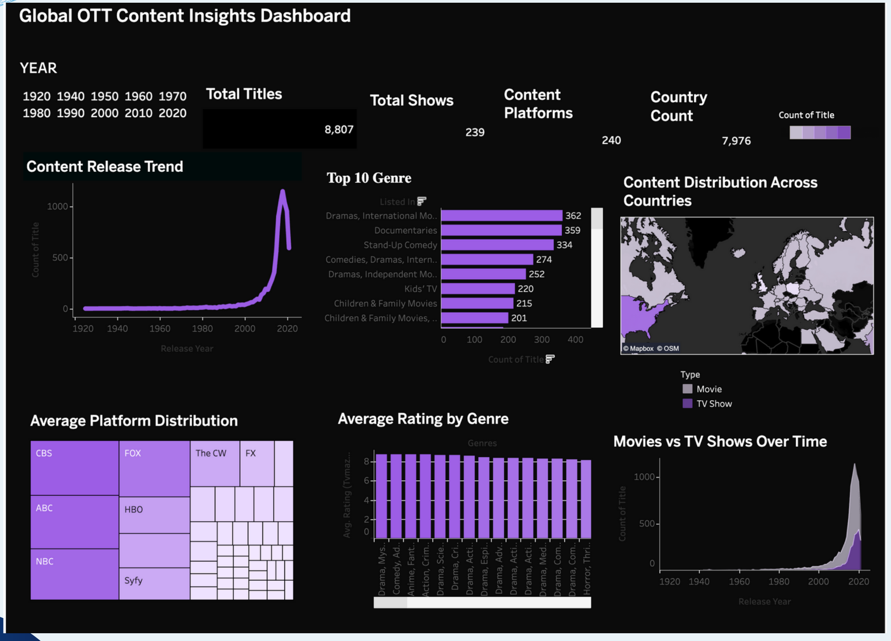
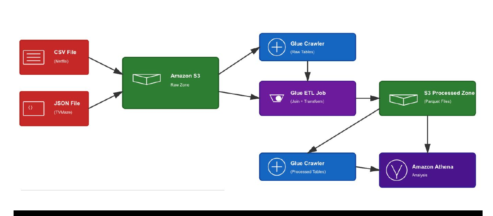

# Global OTT Content Analytics on AWS

A cloud-based analytics pipeline that combines structured Netflix catalog data with semi-structured TVMaze data, transforms the sources with AWS Glue and PySpark, queries the processed output through Amazon Athena, and presents the results in Tableau.



## Project objective

The project explores how streaming content varies across time, genres, countries, content types, and distribution platforms. It was designed to answer questions such as:

- How has content production changed over time?
- Which genres appear most frequently in the Netflix catalog?
- Which countries contribute the most titles?
- How do movies and TV shows compare across release years?
- How do platform coverage and average ratings vary by genre?

## Architecture



The implemented workflow follows these stages:

1. Store Netflix CSV and TVMaze JSON source files in an Amazon S3 raw-data zone.
2. Use AWS Glue Crawlers to infer schemas and register tables in the Glue Data Catalog.
3. Run an AWS Glue ETL job written in PySpark to clean fields, normalize titles, extract release years, and join the sources.
4. Write the transformed data to an S3 processed-data zone in Parquet format.
5. Catalog the processed output and validate analytical queries with Amazon Athena.
6. Connect the prepared data to Tableau for interactive analysis.

## Data sources

- [Netflix Movies and TV Shows on Kaggle](https://www.kaggle.com/datasets/shivamb/netflix-shows) - approximately 8,800 catalog records with title, type, genre, country, release year, rating, cast, and related metadata.
- [TVMaze API](https://www.tvmaze.com/api) - semi-structured JSON data describing shows, genres, premiere dates, languages, ratings, networks, web channels, and countries.

The source datasets are not redistributed in this repository. Follow the providers' current terms when downloading or using their data.

## Transformation logic

The Glue job:

- selects analysis-ready columns from both catalog tables;
- normalizes title text to lowercase;
- derives release year from TVMaze premiere dates;
- joins matching titles on normalized title and release year;
- separates Netflix and TVMaze attributes with clear column names; and
- writes the result as Parquet for downstream querying.

The cleaned reference implementation is available in [`src/glue_etl_job.py`](src/glue_etl_job.py). Runtime values such as database names, table names, and the output S3 path are supplied as AWS Glue job arguments rather than embedded credentials.

## Dashboard views

The Tableau dashboard includes:

- content release trends;
- top Netflix genres;
- country-level title distribution;
- platform distribution;
- average rating by genre; and
- movies versus TV shows over time.

## Findings

The project snapshot showed rapid catalog growth after 2010, strong representation of dramas, documentaries, stand-up comedy, and international content, and increasing TV-show production in recent years. Country-level views highlighted the United States, India, and the United Kingdom as major title contributors in the analyzed catalog.

These findings describe the supplied datasets and collection period; they should not be interpreted as estimates of total market demand or viewing behavior.

## Repository structure

```text
.
├── assets/
│   ├── architecture.png
│   └── dashboard.png
├── data/
│   └── README.md
├── src/
│   └── glue_etl_job.py
└── README.md
```

## Reproducing the pipeline

1. Download the Netflix dataset and retrieve TVMaze data through its API.
2. Upload the source files to separate prefixes in an S3 bucket.
3. Create Glue Crawlers for the raw sources.
4. Configure the arguments documented in `src/glue_etl_job.py` and run the Glue job.
5. Crawl the Parquet output and query it through Athena.
6. Connect Tableau to the prepared analytical output and rebuild the views shown above.

AWS usage may incur charges. Remove unused crawlers, jobs, and stored data after testing.

## Project context

This was a two-person academic group project completed for IE 6750: Data Warehousing and Integration at Northeastern University in Fall 2025.

**Contributors:** Pooja Mishra and Sneha Mishra

Only selected, non-sensitive project documentation is included. AWS account identifiers, credentials, personal email addresses, and private console details have been excluded.

